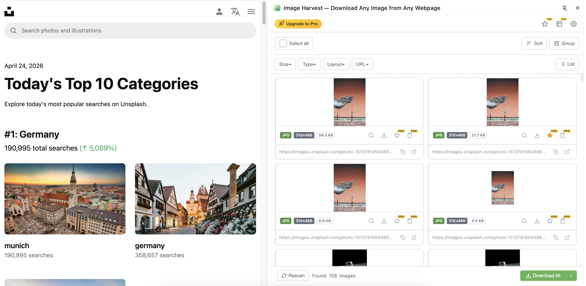
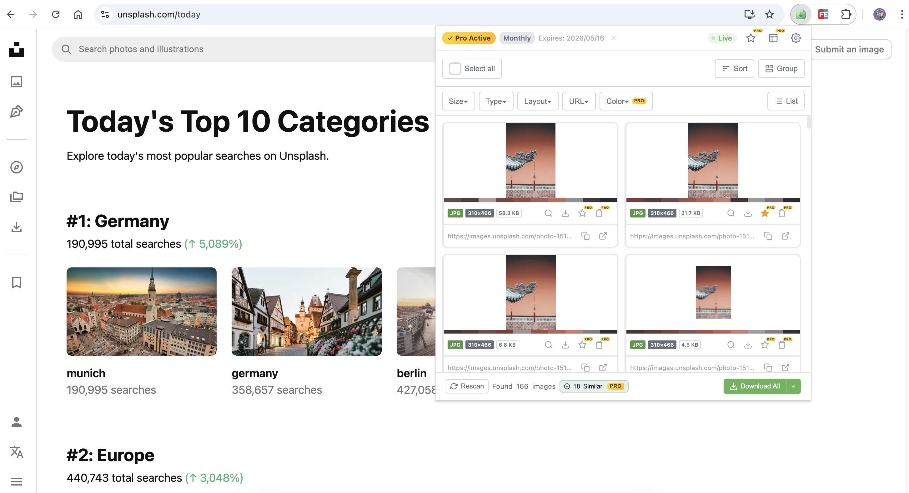

# Image Harvest

<p align="center">
  <strong><a href="./README.md">English</a> | 简体中文</strong>
</p>

<p align="center">
  
</p>

<p align="center">
  <strong>智能识别并批量下载任意网页中的所有图片。</strong>
</p>

<p align="center">
  <a href="https://chromewebstore.google.com/detail/iecgnjidmogebokcfnejncgnelcepffo">
    
  </a>
  <a href="https://chromewebstore.google.com/detail/iecgnjidmogebokcfnejncgnelcepffo">
    
  </a>
  <a href="https://chromewebstore.google.com/detail/iecgnjidmogebokcfnejncgnelcepffo">
    
  </a>
  <a href="https://github.com/zbw-zbw/image-harvest/stargazers">
    
  </a>
  <a href="https://github.com/zbw-zbw/image-harvest/blob/master/LICENSE">
    
  </a>
</p>

<p align="center">
  
  
  
  
  
</p>

<p align="center">
  <a href="https://chromewebstore.google.com/detail/iecgnjidmogebokcfnejncgnelcepffo">
    <strong>🛒 从 Chrome Web Store 安装</strong>
  </a>
  &nbsp;·&nbsp;
  <a href="./docs/README.md">
    <strong>📖 完整文档</strong>
  </a>
  &nbsp;·&nbsp;
  <a href="https://image-harvest.kyriewen.cn">
    <strong>🌐 访问官网</strong>
  </a>
  &nbsp;·&nbsp;
  <a href="https://image-harvest.kyriewen.cn/pricing">
    <strong>💎 定价方案</strong>
  </a>
</p>

---

## 🎬 功能演示

<p align="center">
  
</p>

<p align="center">
  <em>在任意网页打开侧边栏 → 智能扫描 → 按尺寸/格式/布局筛选 → 一键打包下载 ZIP，全程一气呵成。</em>
</p>

---

## 📖 项目文档

- 🏗️ **[架构文档](./docs/ARCHITECTURE.zh-CN.md)** —— 运行时模型、IPC 协议、状态机、性能预算（[English](./docs/ARCHITECTURE.md)）
- 🔒 **[安全策略](./SECURITY.zh-CN.md)** —— 漏洞披露流程、信任边界、权限说明（[English](./SECURITY.md)）
- 🛡️ **[隐私政策](./docs/PRIVACY.zh-CN.md)** —— 数据处理、遥测细节、用户控制（[English](./docs/PRIVACY.md)）
- 🤝 **[参与贡献](./CONTRIBUTING.zh-CN.md)** —— 开发环境搭建、编码规范、PR 流程（[English](./CONTRIBUTING.md)）
- 📜 **[行为准则](./CODE_OF_CONDUCT.zh-CN.md)** —— 社区行为规范（[English](./CODE_OF_CONDUCT.md)）
- 📋 **[更新日志](./CHANGELOG.md)** —— 发版记录
- 🛒 **[Chrome 商店素材](./docs/chrome-store/)** —— 商店上架描述与简介文案（开源）
- 🌐 **官方网站** —— [image-harvest.kyriewen.cn](https://image-harvest.kyriewen.cn)

> 产品规划（PRD）、营销策略、各平台推广文案等商业运营文档保留在独立私有仓库，不随本开源版本分发。
>
> 👉 **文档目录：** [`docs/README.md`](./docs/README.md)

---

## 🆕 最近更新

> 顶部速览，避免每次都翻 [CHANGELOG.md](./CHANGELOG.md)。

- **🎯 匿名 opt-in 埋点** —— 在不上传任何 URL、图片或可识别身份信息的前提下，了解哪些功能真正被用到。位置：**设置 → 帮助改进（匿名使用数据）**，默认关闭，需用户主动开启。
- **🌍 5 种语言界面** —— 英语、简体中文、繁體中文、日本語、Español。自动按浏览器语言识别，可在设置中手动切换。
- **🆓 Pro 7 天免费试用** —— 试用期内可使用全部 Pro 功能，期内取消不收任何费用。
- **💰 30 天无理由退款** —— 所有付费方案 30 天内全额退款，一封邮件搞定。详见 [退款政策](https://image-harvest.kyriewen.cn/refund)。
- **🔍 反向图片搜索** —— 右键菜单内置 Google + TinEye（免费）；Pro 解锁 Baidu + Yandex。
- **📚 长文教程** —— 全新上线 [Image Harvest Blog](https://image-harvest.kyriewen.cn/blog)，涵盖批量下载、Pinterest/Instagram 抓图、2026 年 Chrome 图片下载器横评等。

---

## ✨ 功能特性

### 🔍 智能图片抓取

- **`` 标签** —— 支持 `srcset` 高分辨率候选，自动选择最高分辨率版本
- **CSS `background-image`** —— 内联样式与外部样式表均可识别
- **`<picture>` / `<source>` 元素**
- **同源 iframe** 内容提取
- **Shadow DOM** 深度遍历
- **实时监控（Live Monitoring）** —— 通过 `MutationObserver` 实时检测页面新增图片 _(Pro)_

### 🖼️ 图片展示与管理

- **网格 / 列表视图** 切换，支持 3 种密度（紧凑 / 标准 / 舒适）
- **色彩提取** —— 每张图片显示前 5 种主色调 _(Median Cut 算法)_
- **基于感知哈希（pHash）的相似图片检测** _(Pro)_

### 🎛️ 强大的过滤与排序

- **尺寸过滤** —— 全部 / 小 / 中 / 大 / 超大 / 自定义范围
- **格式过滤** —— JPG / PNG / WebP / SVG / GIF / 其他（多选）
- **布局过滤** —— 全部 / 正方形 / 横向 / 纵向 / 全景
- **URL 关键词搜索** —— 实时搜索（带防抖）
- **智能分组** —— 按域名 / 格式 / 尺寸范围 / 标签页分组
- **排序** —— 按尺寸（升/降序）、格式或自然顺序

### 📥 下载与导出

- **单张图片下载** —— 原始格式或转换后格式
- **批量 ZIP 下载** —— 基于 JSZip
- **格式转换** —— PNG / JPG / WebP，基于 Canvas API _(Pro)_
- **自定义命名模板** —— `{index}`、`{original}`、`{pageTitle}`、`{pageDomain}`、`{width}`、`{height}`、`{format}`、`{date}` 等 _(Pro)_
- **下载进度** 模态框（带进度条）

### 🎯 页面高亮

- 在面板中选择图片 → 网页上对应图片即时高亮
- 自动滚动到高亮位置
- 与面板中的复选框选择状态同步

### ⭐ 图片收藏 _(Pro)_

- 保存图片到本地 IndexedDB，支持标签、备注和元数据
- 浏览、搜索和过滤你的收藏夹
- 批量导出收藏图片为 ZIP

### 🔎 反向图片搜索

- **Google 图片搜索**（免费）
- **TinEye**（免费）
- **百度识图 / Yandex** _(Pro)_

### 🖥️ 双显示模式

- **侧边栏（Side Panel）** —— 与网页并排始终可见
- **弹窗（Popup）** —— 经典弹出窗口（620×600px）
- 可在设置中随时切换

### 🌗 主题与外观

- **跟随系统 / 浅色 / 深色** 主题支持
- 完全基于 CSS 变量的主题系统
- 响应式布局 —— 适配从侧边栏最小宽度到最大宽度

---

## 📸 截图

|                   侧边栏模式                    |                弹窗模式                |
| :---------------------------------------------: | :------------------------------------: |
|  |  |

> 上线后截图可能持续更新，最新截图见 `assets/screenshots/` 目录。

---

## 🚀 安装方式

### 方式一：Chrome Web Store（推荐）

[](https://chromewebstore.google.com/detail/iecgnjidmogebokcfnejncgnelcepffo)

1. 访问 [Chrome Web Store 页面](https://chromewebstore.google.com/detail/iecgnjidmogebokcfnejncgnelcepffo)
2. 点击 **添加至 Chrome**
3. 将插件固定到工具栏以便快速访问

> 喜欢 Image Harvest？欢迎 [留下一条评价](https://chromewebstore.google.com/detail/iecgnjidmogebokcfnejncgnelcepffo/reviews) —— 这对一个独立开发的小项目意义重大。🙏

### 方式二：源码加载（开发者模式）

1. **克隆仓库**

   ```bash
   git clone https://github.com/zbw-zbw/image-harvest.git
   ```

2. **打开 Chrome 扩展页面**

   访问 `chrome://extensions/`

3. **开启开发者模式**

   切换右上角的「开发者模式」开关

4. **加载扩展**

   点击「加载已解压的扩展程序」并选择 `image-harvest` 项目根目录

5. **固定到工具栏**

   点击 Chrome 工具栏中的拼图图标，固定 Image Harvest

---

## 🎮 使用方法

### 快速上手

1. 打开任意包含图片的网页
2. 点击工具栏中的 **Image Harvest** 图标（或按 `Ctrl+Shift+S` / `⌘+Shift+S`）
3. 插件将自动扫描并显示页面上的所有图片
4. 使用过滤器精确筛选，选中图片后单张或批量下载

### 快捷键

| 快捷键                       | 功能                    |
| ---------------------------- | ----------------------- |
| `Ctrl+Shift+S` / `⌘+Shift+S` | 打开/关闭 Image Harvest |

---

## 💎 免费版 vs Pro 版

| 功能                               | 免费版             | Pro 版              |
| ---------------------------------- | ------------------ | ------------------- |
| 智能图片抓取                       | ✅ 完整            | ✅ 完整             |
| 过滤器（尺寸 / 格式 / 布局 / URL） | ✅ 完整            | ✅ 完整             |
| 排序与视图切换                     | ✅ 完整            | ✅ 完整             |
| 单张下载                           | ✅ 完整            | ✅ 完整             |
| 侧边栏 / 弹窗双模式                | ✅ 完整            | ✅ 完整             |
| 批量 ZIP 下载                      | ⚡ 最多 30 张      | ✅ 无限制           |
| 批量复制 URL                       | ⚡ 最多 20 个      | ✅ 无限制           |
| 格式转换                           | ❌                 | ✅ PNG / JPG / WebP |
| 自定义命名模板                     | ⚡ 仅默认模板      | ✅ 完整模板变量     |
| 页面高亮                           | ⚡ 仅单张          | ✅ 批量 + 自动滚动  |
| 智能分组                           | ⚡ 无 / 按格式     | ✅ 全部 5 种        |
| 实时监控                           | ❌                 | ✅ 实时监听         |
| 相似图片检测                       | ❌                 | ✅ 基于 pHash       |
| 图片收藏                           | ⚡ 最多 5 张       | ✅ 无限制           |
| 多标签页提取                       | ❌                 | ✅ 跨标签页         |
| 反向图片搜索                       | ⚡ Google + TinEye | ✅ 4 个引擎         |
| 界面语言                           | ✅ 中/英/繁/日/Es  | ✅ 中/英/繁/日/Es   |

---

## 💵 定价方案

Image Harvest **免费可用**，并为高级用户提供可选的 Pro 方案。

| 方案       |   价格 | 计费周期            | 适合人群                            |
| ---------- | -----: | ------------------- | ----------------------------------- |
| **免费版** |     $0 | 永久                | 普通用户 —— 覆盖 95% 的日常使用场景 |
| **月付**   |  $2.99 | 每月                | 想短期试用 Pro 功能                 |
| **年付**   | $19.99 | 每年（约 44% 优惠） | 长期用户 —— 性价比最高              |
| **终身版** | $29.99 | 一次性付费          | 一次买断，永久使用 —— 无订阅烦恼    |

> 💡 所有 Pro 方案解锁完全相同的功能。完整功能对比请访问 [定价页](https://image-harvest.kyriewen.cn/pricing)。

---

## ⚖️ 为什么选择 Image Harvest

Chrome 商店有几十个"图片下载器"扩展，大多是 2014–2018 年的老作品，多数已无人维护。下面是 Image Harvest 与几款最受欢迎的同类扩展的横向对比 —— 包括我们目前不如对方的地方，写得直白一点。完整测试方法见 [Chrome 图片下载器横评](https://image-harvest.kyriewen.cn/blog/best-image-extractor-chrome)。

| 能力                                     | Image Harvest         | Image Downloader (2014) | Imageye           | Fatkun Batch |
| ---------------------------------------- | --------------------- | ----------------------- | ----------------- | ------------ |
| 现代懒加载站点（`IntersectionObserver`） | ✅ 支持               | ❌ 仅静态 DOM           | ✅ 支持           | ✅ 支持      |
| 批量 ZIP 下载                            | ✅ 免费 30 / Pro 无限 | ❌ 仅单张               | ✅ 含广告         | ✅ 支持      |
| 侧边栏 + 弹窗双模式                      | ✅ 双模               | ❌ 仅弹窗               | ❌ 仅弹窗         | ❌ 仅弹窗    |
| 智能筛选（尺寸 / 格式 / 域名）           | ✅ 完整               | ⚡ 仅尺寸               | ⚡ 有限           | ✅ 完整      |
| 感知哈希去重                             | ✅ Pro                | ❌                      | ❌                | ❌           |
| 实时监控（`MutationObserver`）           | ✅ Pro                | ❌                      | ❌                | ❌           |
| 多标签页批量提取                         | ✅ Pro                | ❌                      | ❌                | ❌           |
| 自定义命名模板                           | ✅ Pro                | ❌                      | ❌                | ⚡ 有限      |
| 反向图片搜索（内置 Google + TinEye）     | ✅ 免费               | ❌                      | ❌                | ❌           |
| 仅匿名 opt-in 埋点                       | ✅ 一键开关           | n/a（无维护）           | ⚠️ 含广告网络     | ✅ 支持      |
| 持续维护至 2026                          | ✅ 是                 | ❌ 已废弃               | ⚠️ 偶尔更新       | ⚠️ 偶尔更新  |
| 免费层永久可用                           | ✅ 是                 | ✅ 是                   | ⚡ 含广告         | ✅ 是        |
| Pro 含 7 天试用 + 30 天退款              | ✅ 是                 | ❌ 无 Pro 层            | ⚡ 退款政策不清晰 | ❌ 无 Pro 层 |

**目前我们的短板**：暂无 Firefox 端、不抓视频、免费层 ZIP 上限 30 张。这是为了让 95% 主用例的体验保持轻快和清爽而做的取舍。

---

## 🛠️ 技术栈

| 组件     | 技术                                 | 选型理由                     |
| -------- | ------------------------------------ | ---------------------------- |
| 平台     | Chrome 扩展 Manifest V3              | 最新扩展标准                 |
| UI       | 原生 HTML/CSS/JS                     | 零框架依赖，包体积最小化     |
| ZIP 打包 | JSZip                                | 成熟稳定，支持 blob 流式生成 |
| 图片抓取 | DOM 遍历 + `getComputedStyle`        | 精准获取运行时背景图         |
| 感知哈希 | Canvas API + DCT                     | 纯前端实现，无外部依赖       |
| 色彩提取 | Canvas API + Median Cut              | 纯前端实现，提取主色调       |
| 格式转换 | Canvas API（`toDataURL` / `toBlob`） | 支持 PNG / JPG / WebP 互转   |
| 收藏存储 | IndexedDB                            | 支持大数据集和 Blob 存储     |
| 设置存储 | `chrome.storage.local` / `sync`      | 持久化用户偏好               |

---

## 🔒 隐私与安全

- **全部本地处理** —— 图片抓取、哈希、色彩分析、格式转换全部在浏览器中完成
- **匿名遥测，需手动开启** —— 为了解哪些功能最被需要，我们提供少量匿名使用数据上报，**仅在你首次启动时点击"Sure, help improve"后才会启用**。可随时在 **设置 → Help Improve (Anonymous Usage Data)** 中关闭
  - **会收集的**：按钮点击、扫描/下载次数、功能使用事件
  - **绝不会收集的**：URL、页面标题、图片地址、图片内容、IP、邮箱、License Key，或任何可能识别你身份的信息
  - **如何保证匿名**：每个事件只携带一个 16 位的安装 id 哈希（绝不上传原始 id），数据发往我们自建的 endpoint —— 不接入 Google Analytics、不接入 Mixpanel、不与任何第三方共享
- **始终在你的掌控之中** —— 遥测开关一键切换，你的选择会跨会话保留；卸载插件会清空所有本地数据

---

## 🌐 官网与支持

- **官方网站**：[image-harvest.kyriewen.cn](https://image-harvest.kyriewen.cn)
- **定价页**：[image-harvest.kyriewen.cn/pricing](https://image-harvest.kyriewen.cn/pricing)
- **常见问题**：[image-harvest.kyriewen.cn/faq](https://image-harvest.kyriewen.cn/faq)
- **支持邮箱**：[support@kyriewen.cn](mailto:support@kyriewen.cn)
- **Bug 反馈与功能建议**：[GitHub Issues](https://github.com/zbw-zbw/image-harvest/issues)
- **留下评价**：[Chrome Web Store 评价页](https://chromewebstore.google.com/detail/iecgnjidmogebokcfnejncgnelcepffo/reviews)

### 关于营销网站

Image Harvest 的官方营销站（着陆页、定价、常见问题、License 激活入口）部署在 [image-harvest.kyriewen.cn](https://image-harvest.kyriewen.cn)。其源码位于独立仓库中，不属于本开源扩展项目。

---

## 📜 更新日志

完整发布历史详见 [CHANGELOG.md](./CHANGELOG.md)。

**最新版本**：`v1.0.2` —— 🌍 5 国语言 UI（English / 简体中文 / 繁體中文 / 日本語 / Español）、🆓 7 天 Pro 试用、📋 批量复制图片 URL、💳 切换至 Creem 支付，以及首次匿名 opt-in 遥测落地。完整列表见 [CHANGELOG.md](./CHANGELOG.md)。

---

## 📝 License

MIT © [kyriewen](https://github.com/zbw-zbw)
